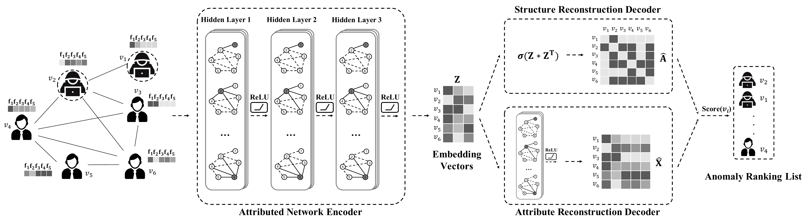

## Dominant

This is the source code of paper "[Deep Anomaly Detection on Attributed Networks](http://www.public.asu.edu/~kding9/pdf/SDM2019_Deep.pdf)".
for the twitter fake follower dataset


## Requirements
python==2.7.3

tensorflow>=1.1.0

## Usage
```python run.py```
